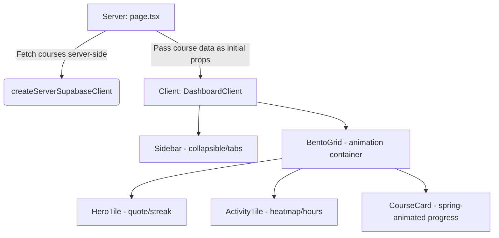

# Aether | Futuristic Student Learning Dashboard

Aether is a production-ready Student Learning Dashboard featuring a dark, premium glassmorphism SaaS aesthetic built with Next.js 15, TypeScript, Tailwind CSS v4, Framer Motion, Supabase, and Lucide React Icons.

---

## 🌌 Theme & Design System

- **Dark Mode Only**: Base color is `#09090B` (near-black) for a sleek, hardware-like surface.
- **Glassmorphism**: Cards use `backdrop-filter: blur(12px)` and semi-transparent borders (`border-white/5`) combined with subtle glowing radial gradients (`gradient-mesh`).
- **Layout**: Bento Grid structure that collapses responsively across different viewport break-points.
- **Typography**: Uses Vercel's optimized `Geist` variable sans-serif font family.

---

## 🏗️ Architecture: Server vs. Client Component Split

To maximize performance, SEO ranking, and page loading speed, this project implements a clear boundaries separation:



### 1. Server Components
- **`app/dashboard/page.tsx`**: Responsible for initiating database queries. Calls the server action `getCourses()` directly.
- **`lib/supabase.ts`**: Builds the Supabase Server Client using `@supabase/ssr` cookies. Awaits Next.js 15 async cookie stores.
- **`lib/actions.ts`**: Integrates server action database fetching. Fallback data triggers automatically on connection warnings.

### 2. Client Components (`"use client"`)
- **`app/dashboard/dashboard-client.tsx`**: Coordinates active tab selection (Overview, Courses, Analytics, Settings) and manages viewport margins.
- **`components/sidebar.tsx`**: Leverages Framer Motion's `layoutId="active-tab"` to slide the nav background highlight smoothly.
- **`components/bento-grid.tsx`**: Sets up entry animation variants (`staggerChildren: 0.15`) that trigger as the cards resolve.
- **`components/course-card.tsx`**: Animates the progress bar width from `0%` to target `%` on load using a `spring` animation over 1.5s.
- **`components/activity-tile.tsx`**: Manages interactive hover tracking and states for the daily study hours heatmap.
- **`components/skeleton-card.tsx`**: Displays shimmering placeholder tiles during resource load.
- **`app/dashboard/loading.tsx`** & **`app/dashboard/error.tsx`**: Render layout shells and error catchers with entry transitions.

---

## 🛠️ Database Setup (Supabase)

Create the `courses` table and seed initial items by running the script in [schema.sql](file:///d:/Next-gen%20Learning/schema.sql) within your Supabase SQL Editor:

```sql
create table courses (
  id uuid primary key default gen_random_uuid(),
  title text not null,
  progress integer not null,
  icon_name text not null,
  created_at timestamp with time zone default now()
);

insert into courses (title, progress, icon_name) values
('Advanced React Patterns', 75, 'Code2'),
('Next.js Mastery', 45, 'Monitor'),
('TypeScript Deep Dive', 90, 'FileCode'),
('Full Stack Development', 60, 'Layers');
```

---

## ⚙️ Environment Variables

Copy `.env.example` to `.env.local` and substitute your Supabase API coordinates:

```bash
cp .env.example .env.local
```

```env
NEXT_PUBLIC_SUPABASE_URL=https://your-supabase-project-id.supabase.co
NEXT_PUBLIC_SUPABASE_ANON_KEY=your-supabase-anon-key-string
```

> **Security note**: The `NEXT_PUBLIC_SUPABASE_ANON_KEY` is safe to expose
> in the browser because Supabase's Row Level Security (RLS) enforces
> access control at the database level. The anon key only grants permissions
> that RLS explicitly allows — it is not a secret.

*Note: If the environment variables are not supplied or match the default template, the dashboard falls back to standard mock datasets automatically, logging a warning rather than crashing.*

---

## 🚀 Getting Started

First, install the packages and launch the hot-reloading development server:

```bash
npm run dev
```

Open [http://localhost:3000](http://localhost:3000) with your browser to preview.

To verify a production bundle build:

```bash
npm run build
```

---

## 🎨 Animation Guidelines (Framer Motion)

- **Entry Staggering**: Tiles enter sequentially using CSS transform (`y: 30 → 0`) and opacity (`0 → 1`) with spring stiffness `300` and damping `20`.
- **Card Hovers**: Scaled up to `1.02` with custom radial glows. Restricts all hover motion to `transform` and `opacity` properties, ensuring **zero layout shifts** and hardware acceleration.
- **Springs**: Progress tracks animate from `0% → progress%` on load using a 1.5s spring easing (`stiffness: 80, damping: 15`).
